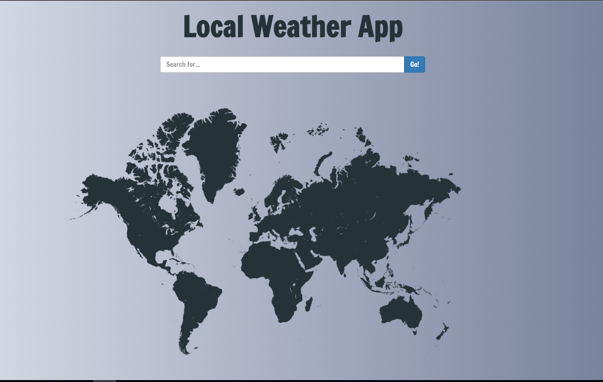
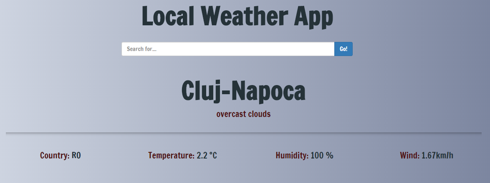

# LocateMe
Weather and location app using Node.js

### Technology Used
- Node JS
- Express JS
- EJS
- Bootstrap
- Wheather API (https://openweathermap.org/api)

### Todos
- add Google Maps API
- refactor the code

